# Deco Hosting - Cloudflare Workers Deployment

This module provides serverless app deployment capabilities via Cloudflare
Workers, allowing users to deploy TypeScript/JavaScript applications with full
MCP (Model Context Protocol) integration.

## Overview

The hosting module enables:

- **Serverless Deployment**: Deploy apps to Cloudflare Workers for global edge
  execution
- **Custom Domains**: Support for custom domain routing with automatic SSL
- **Asset Management**: Static asset upload and serving capabilities
- **Environment Variables**: Secure environment variable management
- **MCP Integration**: Automatic tool discovery and registry publishing
- **Database Integration**: Built-in support for KV, D1, and other Cloudflare
  services

## Architecture

### Main Components

- **`api.ts`** - Main deployment API and tool definitions
- **`deployment.ts`** - Cloudflare Workers deployment logic
- **`bundler.ts`** - Code bundling via external service
- **`wrangler.ts`** - Wrangler configuration parsing
- **`custom-domains.ts`** - Custom domain management
- **`migrations.ts`** - Durable Object migration handling

## Deployment Process

The deployment process is complex and involves multiple async operations. Here's
the complete flow:

### 1. Main Deployment Flow


**Key Steps Explained:**

1. **Validation**: Verify workspace access and parse uploaded files
2. **Configuration**: Parse `wrangler.toml` and validate entrypoint exists
3. **Domain Setup**: Add default `.deco.page` domain and create CF namespace
4. **Bundling**: Optionally bundle code via external service for optimization
5. **Authentication**: Generate JWT token for app-specific API access
6. **Deployment**: Deploy to Cloudflare with full configuration
7. **Database**: Update internal tracking and route management
8. **Registry**: Publish app to discovery registry with tool indexing

### 2. Cloudflare Deployment Details

```mermaid
flowchart TD
    A[☁️ Deploy to Cloudflare] --> B[🔍 Get Existing Bindings<br/>⏱️ ASYNC: CF API Get Script Settings]
    
    B --> C[🔄 Calculate DO Migrations<br/>Compare old vs new bindings]
    
    C --> D[🌐 Setup Custom Domains<br/>⏱️ ASYNC: Multiple Operations]
    D --> E[🔐 Domain Ownership Check<br/>⏱️ ASYNC: DNS Verification]
    E --> F[🏠 Create Custom Hostnames<br/>⏱️ ASYNC: CF Custom Hostnames API]
    
    F --> G[⚙️ Prepare Wrangler Bindings<br/>KV, D1, AI, Browser, Queues, etc.]
    
    G --> H{📁 Has Assets?}
    H -->|Yes| I[📋 Create Assets Manifest<br/>Hash all asset files]
    H -->|No| M[📝 Create Script Metadata]
    
    I --> J[🔄 Create Asset Upload Session<br/>⏱️ ASYNC: CF Asset Upload API]
    J --> K[📤 Upload Assets in Buckets<br/>⏱️ ASYNC: Multiple HTTP uploads]
    K --> L[🎫 Get Asset JWT Token<br/>⏱️ ASYNC: Asset finalization]
    
    L --> M
    M --> N[🧩 Add Node.js Polyfills<br/>File system polyfills]
    
    N --> O[📦 Prepare FormData Body<br/>metadata.json + bundled code]
    
    O --> P[🚀 Update Worker Script<br/>⏱️ ASYNC: CF Workers PUT API]
    
    P --> Q{🔑 Environment Variables?}
    Q -->|Yes| R[🔒 Update Secrets<br/>⏱️ ASYNC: Multiple CF Secret Updates]
    Q -->|No| S[✅ Deployment Complete]
    
    R --> S
    
    style B fill:#ffeb3b,stroke:#f57f17,stroke-width:3px
    style E fill:#ffeb3b,stroke:#f57f17,stroke-width:3px
    style F fill:#ffeb3b,stroke:#f57f17,stroke-width:3px
    style J fill:#ffeb3b,stroke:#f57f17,stroke-width:3px
    style K fill:#ffeb3b,stroke:#f57f17,stroke-width:3px
    style L fill:#ffeb3b,stroke:#f57f17,stroke-width:3px
    style P fill:#ffeb3b,stroke:#f57f17,stroke-width:3px
    style R fill:#ffeb3b,stroke:#f57f17,stroke-width:3px
    
    style S fill:#4caf50,stroke:#388e3c,stroke-width:3px
```



**Cloudflare-Specific Operations:**

- **Binding Management**: Handle KV namespaces, D1 databases, AI models, etc.
- **Asset Upload**: Efficient chunked upload system for static assets
- **Custom Domains**: Automatic SSL certificate provisioning
- **Script Deployment**: Worker code deployment with metadata
- **Environment Secrets**: Secure environment variable management

### 3. Database & Registry Publishing

```mermaid
flowchart TD
    A[💾 Update Database] --> B[🔍 Check if App Exists<br/>⏱️ ASYNC: DB Update Query]
    
    B --> C{🎯 App Found?}
    C -->|No| D[➕ Insert New App<br/>⏱️ ASYNC: DB Insert]
    C -->|Yes| E[⏱️ Update App Timestamp<br/>⏱️ ASYNC: DB Update]
    
    D --> F[📋 Create Deployment Record<br/>⏱️ ASYNC: DB Insert]
    E --> F
    
    F --> G[🔍 Fetch Current Routes<br/>⏱️ ASYNC: DB Query]
    
    G --> H[🔄 Calculate Route Diff<br/>Compare current vs new routes]
    
    H --> I{🗑️ Routes to Delete?}
    I -->|Yes| J[🗑️ Delete Old Routes<br/>⏱️ ASYNC: DB Delete]
    I -->|No| K{➕ Routes to Insert?}
    
    J --> K
    K -->|Yes| L[🌐 Process Custom Domains<br/>⏱️ ASYNC: Multiple Operations]
    K -->|No| M[✅ Database Update Complete]
    
    L --> N[🔄 Promote Deployments<br/>⏱️ ASYNC: Route Updates]
    N --> O[➕ Insert Regular Routes<br/>⏱️ ASYNC: DB Batch Insert]
    
    O --> M
    
    M --> P[📚 Publish to Registry]
    P --> Q[🔍 Ensure Scope Exists<br/>⏱️ ASYNC: Scope Upsert]
    
    Q --> R[📝 Upsert App Registry<br/>⏱️ ASYNC: App Upsert]
    
    R --> S[🔍 Discover Tools via MCP<br/>⏱️ ASYNC: HTTP Request to App]
    
    S --> T[📋 Parse Tool Schemas<br/>Extract names, descriptions, schemas]
    
    T --> U[💾 Batch Insert Tools<br/>⏱️ ASYNC: Multiple DB Upserts]
    
    U --> V[🎉 Registry Publishing Complete]
    
    style B fill:#ffeb3b,stroke:#f57f17,stroke-width:3px
    style D fill:#ffeb3b,stroke:#f57f17,stroke-width:3px
    style E fill:#ffeb3b,stroke:#f57f17,stroke-width:3px
    style F fill:#ffeb3b,stroke:#f57f17,stroke-width:3px
    style G fill:#ffeb3b,stroke:#f57f17,stroke-width:3px
    style J fill:#ffeb3b,stroke:#f57f17,stroke-width:3px
    style N fill:#ffeb3b,stroke:#f57f17,stroke-width:3px
    style O fill:#ffeb3b,stroke:#f57f17,stroke-width:3px
    style Q fill:#ffeb3b,stroke:#f57f17,stroke-width:3px
    style R fill:#ffeb3b,stroke:#f57f17,stroke-width:3px
    style S fill:#ffeb3b,stroke:#f57f17,stroke-width:3px
    style U fill:#ffeb3b,stroke:#f57f17,stroke-width:3px
    
    style V fill:#4caf50,stroke:#388e3c,stroke-width:3px
```



**Database Operations:**

- **App Management**: Track applications and their deployments
- **Route Management**: Handle custom domain routing and promotions
- **Registry Integration**: Automatic publishing to app discovery registry
- **Tool Indexing**: Extract and catalog available MCP tools

## Performance Considerations

### Async/IO Operations (Major Time Consumers)

The deployment process involves numerous async operations that can impact
performance:

1. **🔧 CF Namespace Creation** - Cloudflare API call (~500ms)
2. **🌐 Code Bundling** - External bundler service (~1-3s depending on
   complexity)
3. **🔍 Domain Uniqueness Check** - Database query (~100ms)
4. **🏠 Custom Domain Setup** - Multiple CF API calls (~1-2s per domain)
5. **📤 Asset Upload** - Multiple HTTP uploads (~500ms-2s depending on size)
6. **🚀 Worker Script Deployment** - CF Workers API (~1-2s)
7. **🔒 Environment Variables** - Multiple CF secret updates (~100ms each)
8. **💾 Database Operations** - Multiple DB queries/inserts/updates (~50-200ms
   each)
9. **🔄 Route Management** - Database route operations (~100-300ms)
10. **📚 Registry Publishing** - App and scope upserts (~200ms)
11. **🔍 Tool Discovery** - MCP HTTP request to deployed app (~500ms-1s)
12. **📋 Tool Indexing** - Batch database operations (~100-500ms)

### Optimization Strategies

- **Parallelization**: Uses `Promise.all()` for independent operations
- **Batching**: Groups similar operations (secrets, routes, tools)
- **Caching**: Namespace creation is cached to avoid repeated calls
- **Error Handling**: Graceful degradation for non-critical operations

## API Reference

### Main Tools

#### `HOSTING_APP_DEPLOY`

Deploy files to Cloudflare Workers with full configuration support.

**Input:**

```typescript
{
  appSlug?: string;           // App identifier
  files: FileSchema[];        // Array of files to deploy
  envVars?: Record<string, string>; // Environment variables
  bundle?: boolean;           // Whether to bundle code (default: true)
  unlisted?: boolean;         // Whether to list in registry (default: true)
  force?: boolean;           // Force deployment despite breaking changes
}
```

**Output:**

```typescript
{
  entrypoint: string;         // Main app URL
  hosts: string[];           // All available URLs
  id: string;                // App ID
  workspace: string;         // Workspace identifier
  deploymentId: string;      // Unique deployment ID
}
```

#### `HOSTING_APPS_LIST`

List all deployed apps for the current workspace.

#### `HOSTING_APP_DELETE`

Delete an app and its associated worker.

#### `HOSTING_APP_INFO`

Get detailed information about a specific app.

#### `HOSTING_APP_DEPLOYMENTS_LIST`

List all deployments for a specific app.

### Workflow Tools

#### `HOSTING_APP_WORKFLOWS_LIST_RUNS`

List workflow execution runs with filtering and pagination.

#### `HOSTING_APP_WORKFLOWS_LIST_NAMES`

Get all unique workflow names in the workspace.

#### `HOSTING_APP_WORKFLOWS_STATUS`

Get the current status of a specific workflow instance.

## Configuration

### Required Environment Variables

```bash
CF_ACCOUNT_ID=your_cloudflare_account_id
CF_DISPATCH_NAMESPACE=your_dispatch_namespace
CF_ZONE_ID=your_zone_id
DECO_CHAT_API_JWT_PRIVATE_KEY=your_jwt_private_key
DECO_CHAT_API_JWT_PUBLIC_KEY=your_jwt_public_key
TURSO_GROUP_DATABASE_TOKEN=your_turso_token
TURSO_ORGANIZATION=your_turso_org
```

### Wrangler Configuration

Your `wrangler.toml` should follow the Workers for Platforms format:

```toml
name = "my-app"
compatibility_date = "2025-06-17"
main_module = "main.ts"

# Custom domains (DNS must point to *.deco.page)
routes = [
  { pattern = "my.example.com", custom_domain = true }
]

# Bindings for various services
kv_namespaces = [
  { binding = "MY_KV", id = "your-kv-id" }
]

[[durable_objects.bindings]]
name = "DECO_CHAT_WORKFLOW_DO"
class_name = "Workflow"

[ai]
binding = "AI"

# Deco-specific MCP bindings
[[deco.bindings]]
type = "MCP"
name = "MY_INTEGRATION"
value = "integration-id"
```

## Error Handling

The deployment process includes comprehensive error handling:

- **Validation Errors**: Clear messages for missing files or invalid
  configuration
- **Cloudflare Errors**: Automatic retries and fallback strategies
- **Database Errors**: Transaction rollback and cleanup
- **Network Errors**: Timeout handling and retry logic

## Security

- **JWT Authentication**: App-specific tokens for secure API access
- **Domain Verification**: DNS-based domain ownership verification
- **Environment Isolation**: Secure environment variable management
- **Access Control**: Workspace-based access restrictions

## Monitoring

- **PostHog Analytics**: Deployment success/failure tracking
- **Error Logging**: Comprehensive error reporting
- **Performance Metrics**: Timing data for optimization
- **Audit Trail**: Complete deployment history

## Troubleshooting

### Common Issues

1. **Domain Already Exists**: Check domain uniqueness across workspaces
2. **Bundle Timeout**: Large codebases may need bundle: false
3. **Asset Upload Failed**: Check file sizes and formats
4. **Environment Variable Errors**: Verify secret names and values
5. **Database Timeouts**: Check workspace database connectivity

### Debug Information

Enable debug logging by setting appropriate log levels in your deployment
environment. The system provides detailed timing information for each deployment
phase.
